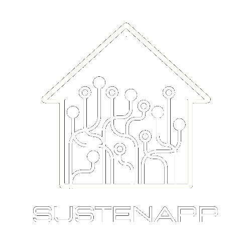

<h1 align=center>SUSTENAPP-API</h1>

<p align="center">
  
</p>

#
### TASKS

- TESTE:
  - *****PROBLEMAS COM BEAN VALIDATION, PROVAVEL PROBLEMA COM O MAVEN*****
  - MELHORAR VALIDACAO EM LISTAS E CAMPOS NULOS
    
#
### TECNOLOGIAS

&nbsp;
&nbsp;
&nbsp;
&nbsp;
&nbsp;
&nbsp;
&nbsp;
&nbsp;
&nbsp;
&nbsp;

#
### DOCUMENTACAO DA API

```
<host>:<porta>/swagger-ui/index.html#
```
